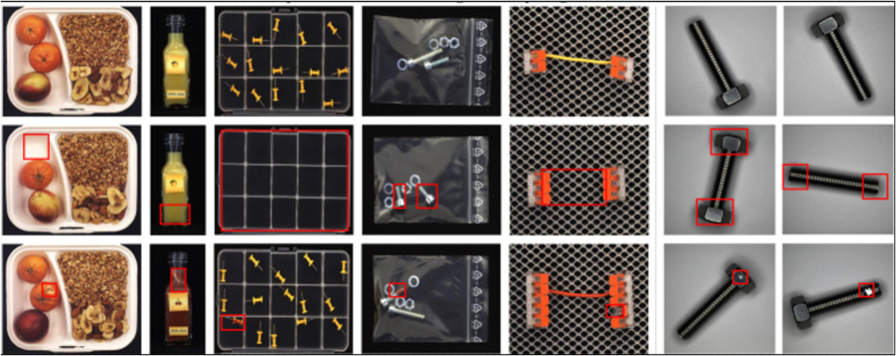

# LogicalAD

<!-- PROJECT LOGO -->
<br />
<div align="center">
    
  <h3 align="center">Logical Anomaly Detection</h3>
</div>

This is the official Logicial Anomaly Detection Algorithm
developed by [Jin Er*](er.jin@lfb.rwth-aachen.de), Qihui Feng, Yongli Mou

## Table of contents

<!-- TABLE OF CONTENTS -->
<details>
  <summary>Table of Contents</summary>
  <ol>
    <li>
      <a href="#getting-started">Getting Started</a>
      <ul>
        <li><a href="#prerequisites">Prerequisites</a></li>
        <li><a href="#installation">Installation</a></li>
      </ul>
    </li>
    <li><a href="#main-figure">Run Training</a></li>
    <li><a href="#run-training">Run Training</a></li>
    <li><a href="#acknowledgments">Acknowledgments</a></li>
  </ol>
</details>


<!-- GETTING STARTED -->
## Getting Started

We recommend to use virtual environment for setting environment. This package have tested with `python==3.10.13` under `ubuntu 22.04.4 LTS`

## Modify dot files 
Please check the modify `.env` file and change it to the location where you save your package

### Prerequisites
Please make sure you have `miniconda` or `anaconda` installed in your system

### Installation

_Below is an example of how you can install all the relevant packages_

1. Create virual environment
   ```sh
    # create env with miniconda/anaconda
    yes | conda create -n logic python=3.10
	pip install torchvision==0.12.0+cu113 torch==1.11.0+cu113 -i https://download.pytorch.org/whl/cu113
    pip install -e .
    pip install requirements.txt
   ```
# Source Packages

# Main Figure

<br />
<div align="center">
    
  <h3 align="center">Logical Anomaly Detection</h3>
</div>


## Running / Training
The config file is saved in `src/anomalib/models/logicad/config.yaml`
```bash
python tools/train.py --config ./src/anomalib/models/logicad/config.yaml
```
or
```bash
python tools/train.py --model logicad
```
## Experiments Results

|MVTec-Loco        | LogicAD |       |AnomlyMoE |         | 
|------------------|---------|-------|----------|---------|
|Metrics           | i-auroc | i-f1  | i-auroc  | i-f1    |
| average          | **81.46** | 78,72    | 67.6     | 79.25   | 
| breakfast_box    | 93.0    | 82.7  | N/A      | N/A     | 
| juice_bottle     | 72,4    | 77,2  | N/A      | N/A     | 
| pushpings        | 74.4    | 69.1   | N/A      | N/A     | 
| screw_bag        | 81.6    | 76.1  | N/A      | N/A     | 
| slicing connector| 90.08  | 86.9  | N/A      | N/A     | 
| slicing connector (w geo loss)| 94.4  | 92.3  | N/A      | N/A     | 

* AnomalyMOE is the CVPR 2024 VAND challenge winner

## Experiment Results Compared with WinCLIP
### MVTec-AD Evaluation Results compared with WinCLIP for Zero-Shot Learning
|MVTec-AD   | LogicAD |          | WinCLIP |          |
|-----------|---------|----------|---------|----------|
|           | i-auroc | i-max-f1 | i-auroc | i-max-f1 |
| **Logic/Obj** |---------|----------|---------|----------|
| cable     |  79.0   |   79.2   | 86.5    | 84.5     |
| capsule   |  84.7   |   92.17  | 72.9    | 91.4     |
| bottle    |         |          | 99.2    | 97.6     |
| screw     |  89.1   |   81.8   | 83.3    | 87.4     |
| pill      |  61.8   |   91.6   | 79.1    | 91.6     |
| hazelnut  |         |          | 93.9    | 89.7     |
| zipper    |         |          | 91.5    | 92.9     |
| metal_nut |         |          | 97.1    | 96.3     |
| transistor|         |          | 88.0    | 79.5     |
| toothbrush|         |          | 87.5    | 87.9     |
| **Texture**   |---------|----------|---------|----------|
| carpet    |         |          | 100     | 99.4     |
| grid      |         |          | 98.8    | 98.2     |
| leather   |         |          | 100.0   | 100      |
| tile      |         |          | 100     | 99.4     |
| wood      |         |          | 99.4    | 98.3     |
| average   |         |          | 91.81 | 92.94    |

## Acknowledges 
This package is built based on anomalib, openclip, lighting and hydra

```tex
@misc{falcon2019pytorch,
  title={PyTorch Lightning The lightweight PyTorch wrapper for high-performance AI research. Scale your models, not the boilerplate},
  author={Falcon, W and Team, TPL},
  year={2019}
}

@Misc{Yadan2019Hydra,
  author =       {Omry Yadan},
  title =        {Hydra - A framework for elegantly configuring complex applications},
  howpublished = {Github},
  year =         {2019},
  url =          {https://github.com/facebookresearch/hydra}
}
@misc{anomalib,
      title={Anomalib: A Deep Learning Library for Anomaly Detection},
      author={Samet Akcay and
              Dick Ameln and
              Ashwin Vaidya and
              Barath Lakshmanan and
              Nilesh Ahuja and
              Utku Genc},
      year={2022},
      eprint={2202.08341},
      archivePrefix={arXiv},
      primaryClass={cs.CV}
}
